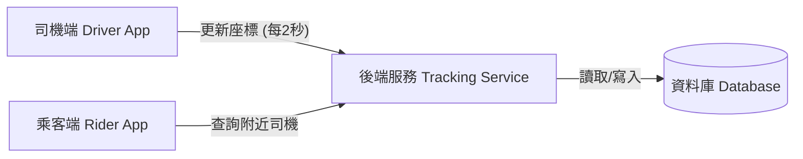
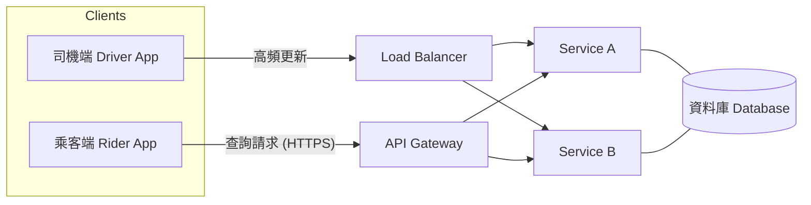
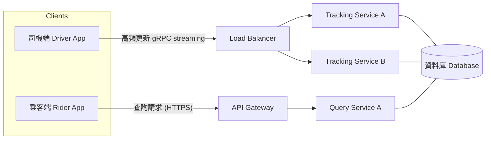
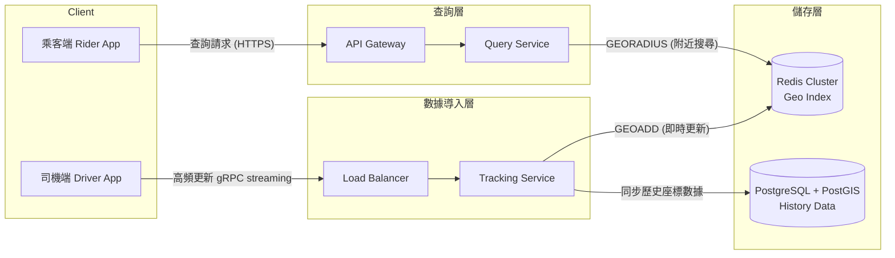
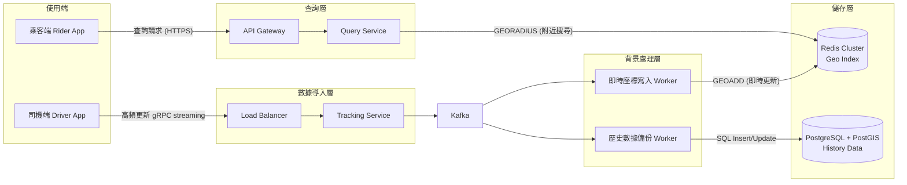

# Init version
**A. 司機端**
* 大約有 3,000 名司機在線 
* 每 2 秒會發送一次 GPS 數據 
* 任務：告訴伺服器「司機是誰，司機人在哪」

**B. 乘客端**
* 他們會向伺服器送請求：「給我目前位置附近有哪些司機」
* 沒有使用者人數

**C. 伺服器**
* 它必須同時支援寫入與查詢
* 負責把司機傳來的座標存進資料庫 
* 乘客需要去讀取司機位置資料

# 2th version
**A. 司機端**
* 會有大流量進入， 1,500 次請求/秒 (RPS)
* 快速上傳定位數據給伺服器

**B. 乘客端**
* 偏向「一般功能查詢」，乘客查詢「附近司機」單純種商業邏輯請求。

### 細部元件
* Load Balancer (負載平衡器)：它是系統的「分流器」。當司機們發送 GPS 數據時，負載平衡器會把這些請求平均分配給後端多台 Service 。

* API Gateway (API 閘道)：在處理乘客端的請求時，它負責檢查乘客身份（Auth）並限制流量（Rate Limiting）。

### 細部設計
**A. 司機端 - 追求高吞吐量，就適合選 Load Balance**

**B. 乘客端 - 一般 API 請求且不考慮量大，可以選 API Gateway 即可**

# 3th version

**1. 服務拆分**

如果服務沒有區分混在一起，當司機流量爆增時，可能會佔用所有 CPU ，導致乘客要查詢根本跑不動，所以就要進一步去考慮CQRS(命令查詢職責分離)，因為司機端屬於寫入密集，而乘客端屬於運算密集，所以可以拆成兩類服務 

**2. 司機端連線方式選擇**
* HTTP POST：司機每 2 秒發一次 Request。所以每 2 秒都需要進行 TCP 三向交握（Handshake），消耗大量的 CPU 資源來處理網路封包。

* WebSocket：司機端只需在開始載客時建立一次連線（Handshake），之後的 GPS 數據都能在同一個長連接中傳輸，標頭極小（僅幾個 Bytes），大幅節省頻寬與 CPU 負載。

* gRPC：二進位傳輸，代表同樣的 GPS 數據，它傳輸的封包體積更小，處理速度更快。**(採用)**

# 4th version

**資料庫的選擇**

* MySQL
  * 優點 : 適合簡單的經緯度儲存
  * 缺點 : 每秒 1,500 次寫入會對磁碟 I/O 負擔很大，頻繁更新又會一直 row lock
  
* PostgreSQL + PostGIS **(採用)**
  * 優點 : PostGIS 擴充功能的地理空間運算功能完整，關聯式資料庫 ACID
  * 缺點 : 同樣是高頻寫入對對磁碟 I/O 負擔

* Redis Geo **(採用)**
  * 優點 : 讀寫吞吐量極高，內建 GeoHash 演算法效率高
  * 缺點 : 記憶體成本較高

# 5th version

**傳統資料庫大流量寫入問題**

接下來會想進一步改善資料寫入 Postgre 的問題，既然是傳統資料庫就會遇到 I/O 效能問題，特別是每秒 1500筆資料更新的情境，那就有可能遇到所有的 Tracking Service 執行緒都會卡在等待資料庫回傳的狀態，很有可能司機會看到連線逾時。

**可採用解決辦法 : 訊息佇列**

已知司機端重點是上傳定位數據給伺服器，那「即時」備份歷史數據就不是首要考量，我就會把這件任務丟給 Message Queue 處理，再讓 worker 收 topic 接續背景處理備份數據的任務。當訊息佇列收到後，就可以回給司機成功，做到低延遲好處

