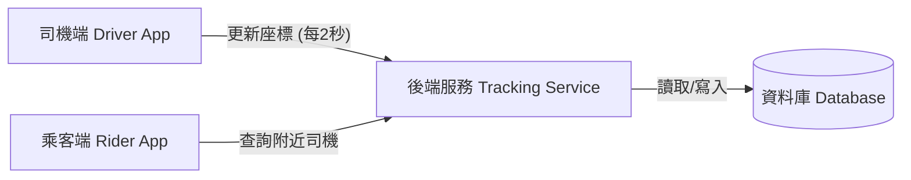

## Init version
**A. 司機端**
* 大約有 3,000 名司機在線 
* 每 2 秒會發送一次 GPS 數據 
* 任務：告訴伺服器「司機是誰，司機人在哪」

**B. 乘客端**
* 他們會向伺服器送請求：「給我目前位置附近有哪些司機」
* 沒有使用者人數

**C. 伺服器**
* 它必須同時支援寫入與查詢
* 負責把司機傳來的座標存進資料庫 
* 乘客需要去讀取司機位置資料

