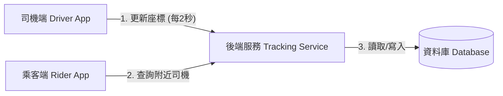

```mermaid
graph LR
    Driver[司機端 Driver App] -- "1. 更新座標 (每2秒)" --> Service[後端服務 Tracking Service]
    Rider[乘客端 Rider App] -- "2. 查詢附近司機" --> Service
    Service -- "3. 讀取/寫入" --> DB[(資料庫 Database)]
```